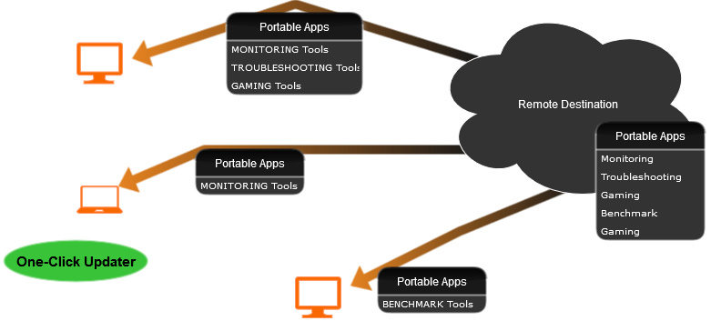
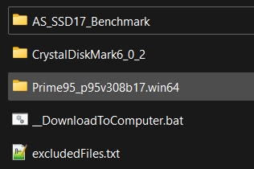

 

## Description

Tired of managing all your portable useful applications on multiple machines? I was, decided to make my solution publicly available.

**Portable App Sync** is a small Batch solution to organize your portable apps (or Whatever) in multiple, independent directories. On each machine you can download only the ones you need. An updater will keep everything up 2 date.
 - No more need to back up these useful tools before deleting your systems before wiping your system
 - Very quick and easy access to your tools needed
 - Keep your tools up to date in a single location
 - You can also easily synchronize them with a USB device and take them with you

**Table of Contents**
- [Description](#description)
- [Requirements](#requirements)
- [Installation](#installation)
- [Usage](#usage)
- [Add your own PAS directories](#add-your-own-pas-directories)
- [How to Contribute](#how-to-contribute)
- [Support Portable App Sync](#support-portable-app-sync)

## Requirements
 - A remote SMB share to store Portable App Sync
 - At least one windows machine

## Installation
1. Download the latest release of the [release section](releases)
2. Create a directory to hold all your PAS directories on your SMB share. *for example: PortableAppSync* `mkdir -p L:\PortableAppSync`
3. Extract your downloaded zip into the directory

## Usage
4. *An example* directory should be there to test. Run the `__DownloadToComputer.bat` batch file to initially download the directory to your computer
5. You'll be asked to choose the root location on this machine
6. Now check out the location you have configured, you should see the `OnlyThisFileWillBeSynced.txt` file, an `Updater.bat` and a shortcut to the `Remote` location of this directory

## Add your own PAS directories
1. Make a copy of `__PAS_System\_newSyncFolderTemplate` to your PAS directory
2. Rename it how you like, `Monitoring` on the remote location will be called `MONITORING Tools` on the client side
3. Drop all your tools into the directory
4. Adjust the `excludedFiles.txt` to exclude files from being synced to the client
5. Everything expect `excludedFiles.txt` `__DownloadToComputer.bat` `*.url` and everything inside **excludedFiles.txt** will not be synced to the client

💡Hint: Add an url to the download page of each tool, those will not be synced

---

## How to Contribute
The goal of this project was exactly what it is now. However, if you find bugs or really good features, I might accept PR.

## Support Portable App Sync
- PortableAppSync is a project I created to solve a problem with managing portable apps, while not having all of them on every machine. I decided to make it public, rewritten most of it and cleaned up the code, because it might help some people.
- [Donate via PayPal](https://paypal.com/donate/?hosted_button_id=NX3BCLM4FPFLS)